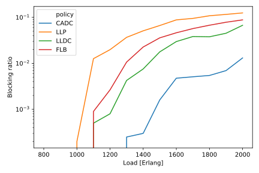
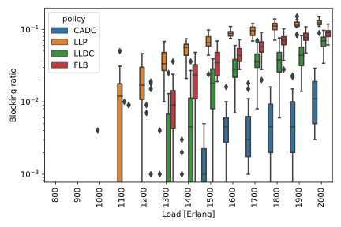
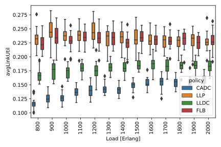

# Simple Opaque WDM Simulator with Anycast Service Requests written in Java

### This simulator is under development and will be updated soon with more resources and documentation

Simple simulator implemented in Java (version >=8) for simulating opaque WDM networks, e.g, optical networks containing wavelength conversion at each node.
This means that the lightpaths do not need to enforce the wavelength continuity constraint.
In simpler terms, the infrastructure simulated in this project can be understood as a circuit-switched (and therefore the *cs* acronym in the project name) network with anycast traffic, i.e., the destination can be selected by the routing algorithm given some criteria.
For more info, see [this paper](https://ieeexplore.ieee.org/abstract/document/767791).
The service requests are modeled as anycast, i.e., the service destination can be selected among the data centers available in the network.
The simulator implements the basic funcionalities, and allows you to add more complex features for your particular purposes.
The simulator offers multi-threading for running multiple scenarios using a pool of threads, taking advantage of high-performance computing environments.

### Examples of results generated

| Plots with averages | Plots with distributions |
| :---: | :---: |
| Blocking probability |
|  |  |
| Link utilization |
|  |  |

Results generated by a jupyter notebook which reads the results files and plots the results available [here](./resources/notebooks/python-generate-plots.ipynb).

### Other versions available

**You may also be interested in the Python implementation of this simulator.** An anycast version (with similar properties to this one) is available [here](https://github.com/carlosnatalino/python-simple-anycast-wdm-simulator). A version with unicast demands is available [here](https://github.com/carlosnatalino/python-simple-opaque-wdm-simulator). 

### Dependencies:

The code was developed using [NetBeans](https://netbeans.org/), but by being a gradle project you can use your preferred IDE. The software has the following dependencies:

- Gradle (for dependency and build management)
- Log4J (for advanced logging features)
- jGraphT (for graph manipulation and path computation)
- Typesafe Config (for configuration file reading)
- xGraph (for plot generation)

### Code organization and features:

This simulator implements and/or leverages the following functionalities:
- Uses gradle build tool to accelerate development and build, and facilitate dependency management;
- Uses the multithreading capabilities of Java to execute several simulation scenarios (configurations) in parallel;
- Reads topology files from the [SNDlib](http://sndlib.zib.de/) topology database (*under development*);
- Generates timestamp'd folder where results are saved to avoid rewriting important results;
- Leverages the reflection capabilities of Java to facilitate the development and configuration;
- Uses external configuration files, not requiring recompilation to change configurations, making it also appropriate for running in cluster or HPC research platforms.

The following routing policies are implemented:
- **Closest available data center (CADC)**: selects the data center with enough capacity that has the shortest available path.
- **Least loaded data center (LLDC)**: selects the data center with the most available capacity that has an available path.
- **Least loaded path (LLP)**: selects the least loaded path that reaches a DC with enough capacity.
- **Full load balancing (FLB)**: selects the path and data center with the lowest combined load, i.e., the combined load is computed as the multiplication of the path and data center current usage.

An analysis of the routing/placement algorithms can be found [here](https://ieeexplore.ieee.org/abstract/document/6294216).

The following package organization is used:
- [*simulator.cs.anycast.**components**:*](./src/main/java/simulator/cs/anycast/components) This package contains the modeling of all the resources available for the simulation, e.g., links, nodes.
- [*simulator.cs.anycast.**core**:*](./src/main/java/simulator/cs/anycast/core) This package contains the core classes of the simulator.
- [*simulator.cs.anycast.**events**:*](./src/main/java/simulator/cs/anycast/events) This package contains classes related to simulation event management. As of now, connection arrival and departure are the only ones. For instance, you could add link failure events by adding a class in this package, similar to the scenario considered in [this paper](#Citing-this-software).
- [*simulator.cs.anycast.**plot**:*](./src/main/java/simulator/cs/anycast/plot) This package contains classes related to the plot generation.
- [*simulator.cs.anycast.**policies**:*](./src/main/java/simulator/cs/anycast/policies) This package contains classes that implement the policies run by the simulator, including an abstract class that must be implemented by new policies.
- [*simulator.cs.anycast.**utils**:*](./src/main/java/simulator/cs/anycast/utils) This package contains utilitarian classes such as the ones modeling the thread factory and thread object.

### Post-processing the results

**Python:** You can find a jupyter notebook which reads the results files and plots the results [here](./resources/notebooks/python-generate-plots.ipynb).

**Java:** Reading and plotting results is under development.

### Running with docker

Docker provides an official gradle image [here](https://hub.docker.com/_/gradle). Use `gradle:6.1.1-jdk13` for the latest version of Java (version 13 as of today).

Running the simulator on the docker container:

`docker run -it --rm -u root -v "$PWD":/home/gradle/project -w /home/gradle/project gradle:6.1.1-jdk13 gradle run`

Generating a slim jar file on the docker container:

`docker run -it --rm -u root -v "$PWD":/home/gradle/project -w /home/gradle/project gradle:6.1.1-jdk13 gradle jar`

Generating a complete jar (with dependencies) on the docker container:

`docker run -it --rm -u root -v "$PWD":/home/gradle/project -w /home/gradle/project gradle:6.1.1-jdk13 gradle fullJar`

Get a terminal to the docker container:

`docker run -it --rm -u root -v "$PWD":/home/gradle/project -w /home/gradle/project gradle:6.1.1-jdk13 bash`

### Citing this software

This software was developed as part of the following research paper:

C. N. da Silva, L. Wosinska, S. Spadaro, J. C. W. A. Costa, C. R. L. Frances and P. Monti, "Restoration in optical cloud networks with relocation and services differentiation," in IEEE/OSA Journal of Optical Communications and Networking, vol. 8, no. 2, pp. 100-111, Feb. 2016. DOI: 10.1364/JOCN.8.000100. [Open access](http://www.diva-portal.org/smash/record.jsf?pid=diva2%3A925332&dswid=-6552)

BibTeX entry:

~~~~
@ARTICLE{Natalino:2016:jocn,
    author={C. N. {da Silva} and L. {Wosinska} and S. {Spadaro} and J. C. W. A. {Costa} and C. R. L. {Frances} and P. {Monti}},
    journal={IEEE/OSA Journal of Optical Communications and Networking},
    title={Restoration in optical cloud networks with relocation and services differentiation},
    year={2016},
    volume={8},
    number={2},
    pages={100-111},
    doi={10.1364/JOCN.8.000100},
    ISSN={1943-0620},
    month={Feb},
    }
~~~~

